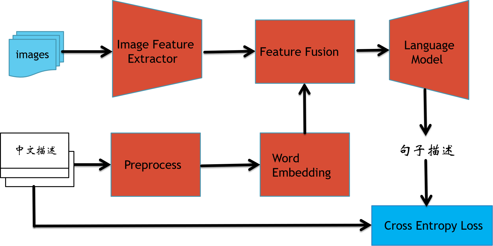
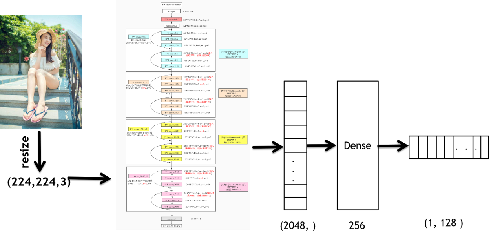
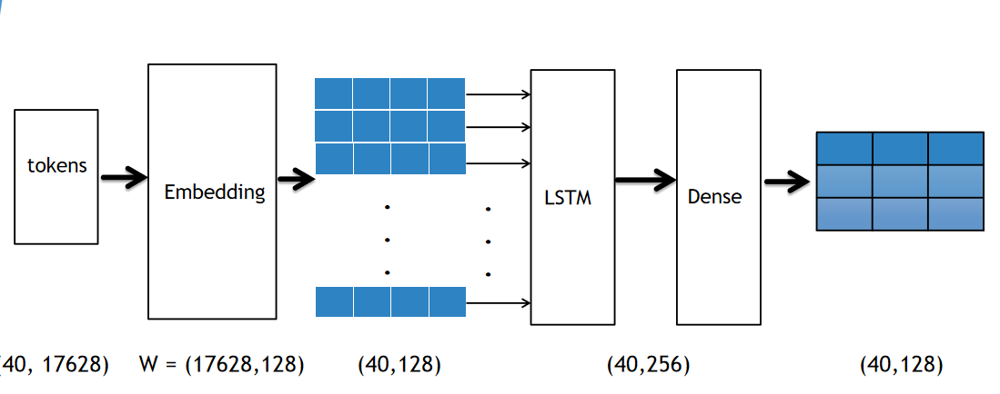
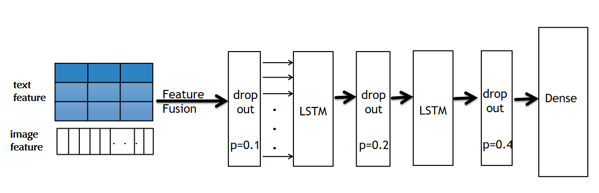

# 图像中文描述
图像中文描述问题融合了计算机视觉与自然语言处理两个方向，对图片输出一句话的描述。  
描述句子要求符合自然语言习惯，点明图像中的重要信息，涵盖主要人物、场景、动作等内容。 

## Environment
Python==3.6  
Tensorflow==1.14  
Keras==2.3.1
## 数据集
数据来自[2017 AI Challenger](https://challenger.ai/competition/caption)  
数据集对给定的每一张图片有五句话的中文描述。数据集包含30万张图片，150万句中文描述。  
训练集：210,000 张   
验证集：30,000 张   
测试集 A：30,000 张   
测试集 B：30,000 张  
[数据集下载]  
Caption train:链接:https://pan.baidu.com/s/1YziBPLiU2WmE0j35oaXeKw    密码:asix  
Caption validation :链接:https://pan.baidu.com/s/1p_0V89d4wfxk-7f7QsU9rg 密码:dcnn


### 模型


##### 1.ResNet50提取特征


##### 2.文本信息提取


##### 3.特征融合


### 数据预处理
```bash
$ python generated.py
```

### 训练
```bash
$ python backward.py
```
### 可视化训练过程
```bash
$ tensorboard --logdir path_to_current_dir/logs
```
###指标测试
   See caption_eval/README.md
###图片单独生成描述
```bash
$ python generate_caption.py
```